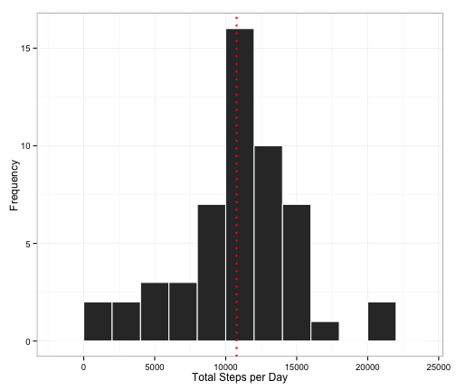
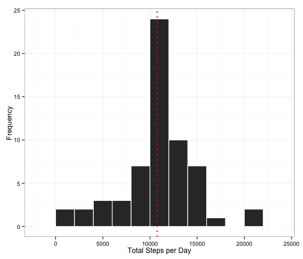

# Reproducible Research: Peer Assessment 1
## Personal Activity Monitoring
### David Modjeska

<br>


### Loading and preprocessing the data


```r
library(dplyr)
library(lubridate)
library(stringr)
steps_data <- read.csv("activity.csv") %>%
    mutate(datetime = ymd(date)) %>%
    select(-date)
good_steps_data <- steps_data %>%
    filter(!is.na(steps))
bad_steps_data <- steps_data %>%
    filter(is.na(steps))
```

<br>

### What is the mean total number of steps taken per day?

Let's calculate the total, mean, and median number of steps taken per day.


```r
# Calculate the total and central values
daily_steps <- good_steps_data %>%
    group_by(yday(datetime)) %>%
    summarize(Total_Daily_Steps = sum(steps))
mean_total_daily_steps <- mean(daily_steps$Total_Daily_Steps)
median_total_daily_steps <- median(daily_steps$Total_Daily_Steps)
```
Now, let's see a histogram showing the total and mean steps per day.


```r
# Plot the distribution
library(ggplot2)
options(scipen = 1, digits = 2)
ggplot(daily_steps, aes(Total_Daily_Steps)) + 
        geom_histogram(binwidth = 2000, color = "white") +         
        geom_vline(xintercept = mean_total_daily_steps, color = "red", 
                   linetype = "dotted", size = 1) +
        xlab("Total Steps per Day") + ylab("Frequency") + theme_bw()
```

 

For the total number of steps taken per day, the mean is 10766.19 
and the median is 10765.

<br>

### What is the average daily activity pattern?


```r
# Analyze the pattern
interval_steps <- good_steps_data %>%
    group_by(interval) %>%
    summarize(Mean_Interval_Steps = mean(steps)) %>%
    mutate(pad_interval = str_pad(interval, 4, side = "left", "0")) %>%
    mutate(plot_interval = parse_date_time(pad_interval, order = c("HM", "M")))

# Find the maximum interval
max_interval <- filter(interval_steps, 
                      Mean_Interval_Steps == max(Mean_Interval_Steps))
text_interval <- format(max_interval$plot_interval, "%H:%M")

# Plot the pattern
library(scales)
ggplot(interval_steps, aes(plot_interval, Mean_Interval_Steps)) +
    scale_x_datetime(labels = date_format("%H:%M")) +
    geom_line(stat = "identity") +
    geom_text(aes(x = max_interval$plot_interval, 
                  y = max_interval$Mean_Interval_Steps, 
                  label = round(max_interval$Mean_Interval_Steps, 2)),
              hjust = -0.25, vjust = 2, size = 3, color = "blue") +
    xlab("Time Interval") + ylab("Mean Number of Steps") + theme_bw()
```

 

The 08:35 interval, on average across all the days in the 
dataset, contains the maximum number of steps. Other peak intervals around 12:00, 16:00, and 19:00 may reflect activities such as meals and breaks/snacks. Further research would be needed to identify these activities.

<br>

### Imputing missing values


```r
# Calculate the number of NA's
numNa <- sum(is.na(steps_data$steps))
```

The total number of missing values in the dataset is 2304.

Let's fill in all of the missing values in the dataset. A simple strategy should work: for each missing value, using the mean of all good values for that 5-minute interval. These means were calculated previously.


```r
# Impute the missing values
clean_steps_data <- bad_steps_data %>%
    inner_join(interval_steps, by = "interval") %>%
    mutate(steps = Mean_Interval_Steps) %>%
    mutate(steps = round(steps, 0)) %>%
    select(-Mean_Interval_Steps) %>%
    bind_rows(good_steps_data)
```

Let's re-calculate the total, mean, and median number of steps taken per day.


```r
# Recalcuate the total and central values
clean_daily_steps <- clean_steps_data %>%
    group_by(yday(datetime)) %>%
    summarize(Total_Daily_Steps = sum(steps))
mean_total_daily_steps_2 <- mean(clean_daily_steps$Total_Daily_Steps)
median_total_daily_steps_2 <- median(clean_daily_steps$Total_Daily_Steps)
```

Now, let's see a new histogram showing the total and mean steps per day.


```r
# Re-plot the distribution
library(ggplot2)
options(scipen = 1, digits = 2)
ggplot(clean_daily_steps, aes(Total_Daily_Steps)) + 
        geom_histogram(binwidth = 2000, color = "white") +         
        geom_vline(xintercept = mean_total_daily_steps_2, color = "red", 
                   linetype = "dotted", size = 1) +
        xlab("Total Steps per Day") + ylab("Frequency") + theme_bw()
```

 

For the total number of steps taken per day, the mean is now 10765.64 
and the median is now 10762. The mean and the median differ only slightly from the estimates from the first part of the assignment. The difference is on account of rounding the imputed step values to the nearest interger. The impact of imputing missing data on the estimates on the total daily number of steps - it's predictably to increase this estimate, because there are more observations contributing to the daily total. 

<br>

### Are there differences in activity patterns between weekdays and weekends?

Let's create a new factor variable in the dataset with two levels – “weekday” and “weekend” indicating whether a given date is a weekday or weekend day. 
We're using the dataset with the filled-in missing values for this part.


```r
# Analyze the patterns
weekday_steps_data <- clean_steps_data %>%
    mutate(weekday = wday(datetime)) %>%
    mutate(is_weekday = ifelse(weekday > 5, "Weekends", "Weekdays"))
weekday_interval_steps <- weekday_steps_data %>%
    group_by(interval, is_weekday) %>%
    summarize(Mean_Interval_Steps = mean(steps)) %>%
    mutate(pad_interval = str_pad(interval, 4, side = "left", "0")) %>%
    mutate(plot_interval = parse_date_time(pad_interval, order = c("HM", "M")))
```

Let's make a panel plot containing a time series plot (i.e. type = "l") of the 5-minute interval (x-axis) and the average number of steps taken, averaged across all weekday days or weekend days (y-axis). 


```r
# Plot the patterns
ggplot(weekday_interval_steps, aes(plot_interval, Mean_Interval_Steps)) +
    scale_x_datetime(labels = date_format("%H:%M")) +
    geom_line(stat = "identity") +
    facet_wrap(~ is_weekday, ncol = 1) +
    xlab("Time Interval") + ylab("Mean Number of Steps") + theme_bw()
```

 

It looks like the subject takes more steps on weekend days, on average. The peak  intervals are all higher on weekends, though the intervals leading up to the maximum interval of 08:35 are higher on weekdays. This higher lead-up on weekday mornings may reflect an activity such as commuting or preparing children for school - further research would be needed to determine the particular cause.
